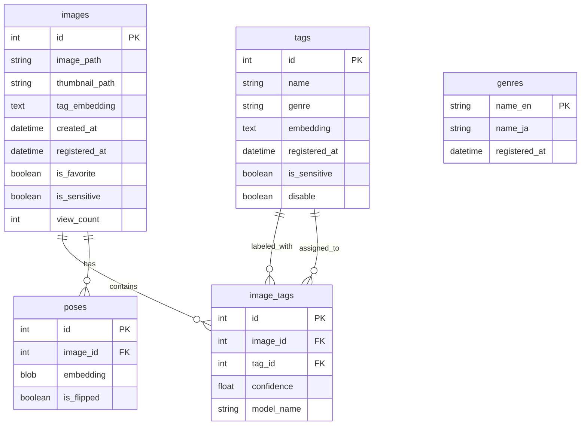

# Tag Palette

## 環境構築

```bash
cd app
uv sync
python -m ensurepip
```

## ビルド方法

```bash
uv run nuitka --onefile --enable-plugin=tk-inter --standalone main.py
```


```mermaid
erDiagram
    images ||--o{ image_tags : contains
    tags ||--o{ image_tags : labeled_with
    images ||--o{ poses : has
    tags ||--o{ image_tags : assigned_to

    images {
        int id PK
        string image_path
        string thumbnail_path
        text tag_embedding
        datetime created_at
        datetime registered_at
        boolean is_favorite
        boolean is_sensitive
        int view_count
    }

    tags {
        int id PK
        string name
        string genre
        text embedding
        datetime registered_at
        boolean is_sensitive
        boolean disable
    }

    image_tags {
        int id PK
        int image_id FK
        int tag_id FK
        float confidence
        string model_name
    }

    poses {
        int id PK
        int image_id FK
        blob embedding
        boolean is_flipped
    }

    genres {
        string name_en PK
        string name_ja
        datetime registered_at
    }

```
